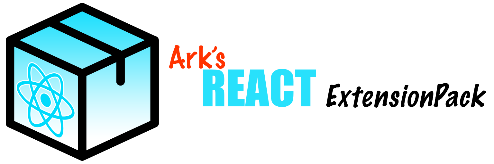

[marketplace.visualstudio/ark-react-extensions-pack](https://marketplace.visualstudio.com/items?itemName=AlvaroAlmendros.ark-react-extensions-pack)

# Ark's React Extensions Pack

- [Ark's React Extensions Pack](#arks-react-extensions-pack)
  - [FAQ](#faq)
    - [Why do I need all those extensions](#why-do-i-need-all-those-extensions)
    - [What about the extensions I've already installed](#what-about-the-extensions-ive-already-installed)
  - [Included Extensions](#included-extensions)
    - [Core](#core)
    - [Linting and Syntax highlighting](#linting-and-syntax-highlighting)
    - [Live Share](#live-share)
    - [Tricks](#tricks)
    - [UI](#ui)
  - [Configuration](#configuration)
  - [How to contribute](#how-to-contribute)

This is a pack with the extensions I use and recommend to my coworkers, so we can activate/deactivate between workspaces easier.
For example, when working with react and angular projects the process of whitelisting workspace only extensions is kind of tedious.

## FAQ

### Why do I need all those extensions

Maybe. You can just disable any extension you don't want to use.
But I recommend you to try them.

- The ones with the icon 🔥 are my favorites!
- Those with the icon 🔒 are a must!

Having less extensions running at the same time will always return a better performance.
But remember that not all extensions are running in the background!: those "on demand" (command palette) extensions weight almost nothing performance wise.

- The extensions with the icon ⚙️ can be kind of heavy on performance

I'll try to explain why I use every extension and how to configure it, **but feel free to add a new PR with any change proposal**.

### What about the extensions I've already installed

Those that aren't included will not be affected.
The ones that are included but were already installed will work as the were, but will be managed with the pack:

- If you enable the pack for a workspace all its extensions (actual and future ones) will be enabled for that workspace
- The same if you disable the pack.
- If you set a unique status for a extension included in the pack, for example you disable the pack as a whole but enable a pair of extensions, the individual settings will prevail over the pack ones.

## Included Extensions

### Core

- 🔒 **ESLint**: Integrates ESLint into VS Code. As we have prettier rules inside our eslintrc file, we will only need to use this linter.
- 🔥 **Project Manager**: To switch between projects/workspaces easily, and take advantage of the automatic extension switch by workspace.
- **Docker**: All the Docker related tools you may need, from management to syntax highlighting.
- **GitLens**: The git swissknife, with blame
- **Jira and Bitbucket (Official)**: To interact with Jira without having to switch to the app/web
- ⚙️ **Path Intellisense**: For VSC to be able to autocompletes filenames
- ⚙️ **TabNine**: AI assisted code completions, will predict the next “token” in the programming sequence based on patterns found in the previous code samples from the same user.
- ⚙️ **Visual Studio IntelliCode**: AI assisted code completions, official by Microsoft.

### Linting and Syntax highlighting

- 🔥 **LintLens**: When editing `.eslintrc` rules, will tell what every rule do and if it's configured correctly.
- 🔥 **Code Spell Checker**: Multi language spell checker.
- **Cucumber (Gherkin) Full Support**
- **DotENV**: DotENV syntax support
- **Jenkinsfile Support**: Jenkinsfile syntax
- **JSON Tools**: JSON prettify and minify on demand.
- **Markdown all-in-one**: Markdown swissknife, with preview, table of contents...
- **Markdown Checkbox**: Adds checkbox/task support like at Github
- **Markdownlint**: Linting and style checking for md files.
- **Rainbow CSV**: Easier CSV edit by adding colors per column.
- **Snippets and Syntax Highlight for Gherkin (Cucumber)**: Mainly highlight for feature files;
- **SVG**: All SVG needs in one extension! SVG Coding, Minify, Pretty, Preview...
- **YAML**: Autocomplete, syntax _(with Kubernetes syntax support)_ and validation

### Live Share

- 🔥 **Live Share**: To edit and debug code coop. A must for remote working.
- 🆕 **Live Share Audio**: 100% integrated into live share and free! Audio for your live share sessions.

### Tricks

- 🔥 **change-case**: A lot of tools to switch case style (camel, kebab, upper...)
- 🔥 **Sort Lines**: Select a few lines and this tool will sort it alphabetically
- 🔥 **Toggle Quotes**: Select a string and with `cmd+'` you can switch between ``, "", and ''
- 🔥 **Turbo Console Log**: Select a variable, then it will add a console log automatically. It can even delete all logs at once!
- **Better Comments**: To colorize todo/fixme
- **File Utils**: To remove, rename, etc a file from command palette
- **Glean**: Refactoring tools, like extract to a new file (so useful!)
- **Jest-cucumber code generator**: Automatic jest-cucumber test generator layout from a `.feature` file
- **Smart Column Indenter**: To indent by columns
- ⚙️ **Javascript Booster**: refactoring tools like convert from/to function to arrow function, and a lot more

### UI

- 🔒 🔥 **Error Lens**: One of my MUST HAVE! Just display linting/ts errors in a very obvious way! Impossible to miss!
- 🆕 **Peacock**: To colorize the vscode theme with a different color per technology/workspace
- **Bracket Pair Colorizer**: Every bracket pair will have the same color!
- **Color-Info**: Add color info when editing colors
- **colorize**: Add colors to MUY Theme colors declaration
- **empty-indent**: Removes empty indent on save
- **Guides**: Better guidelines
- ⚙️ **Image Preview**: Add a preview of the svg/img you are importing if the route is correct
- ⚙️ **Output Colorizer**: Colorize vscode logs

## Configuration

First of all you should install a good all-in-one font, and use it.

I'll recommend you the two I use, from the [NerdFonts](https://github.com/ryanoasis/nerd-fonts) project: JetBrainsMono Nerd Font & DroidSansMono Nerd Font.

This fonts supports font ligatures and have been patched with all kind of icons to be used with advanced ZSH themes like [powerlevel10k](https://github.com/romkatv/powerlevel10k) _(this princess will be talk about in another castle)_

- Do you have brew? If not, lets start by installing it!

  ```bash
  /bin/bash -c "$(curl -fsSL https://raw.githubusercontent.com/Homebrew/install/master/install.sh)"
  ```

- Then...

  ```bash
  brew tap homebrew/cask-fonts
  brew cask install font-jetbrainsmono-nerd-font
  brew cask install font-droidsansmono-nerd-font-mono
  ```

Now that we have brew installed for sure, let me talk you about how to install node correctly, just to be sure.

I hate the official installer and its documentation, and tend to avoid it at all costs. What I do like is [n](https://github.com/tj/n), a Node.js version manager, installed with brew. It will install the node versions you want to use at `/usr/local`, avoiding all kind of shenanigans.

- If you have alread installed node...in your place I probably uninstall it. **If you don't want to just skip this step**.
- Install n and the lts version of node

  ```bash
  brew install n
  n lts
  ```

> _Can anybody find me somebody to love?..._
> **I use brew to install _almost_ everything**. Brew is love! 😍

Now, lets create a custom workspace settings file!
Let's do it the easy way:

- Open VSCode at your react project :)
- Open the command palette: cmd+shift+p
- Type `workspace json`, and you will be able to open the current workspace

Now open the [settings.json](/settings.json) included, and copy it at your workspace settings!
As you can see I have added comments explaining what does every setting :)

When you have this options fulfilled, we can configure how to quick change between workspaces.

- First lest go to the extensions list and disable this addon
- Then enable it **only for the workspace**

Now go to the projects manager and select another project!
In that project you will see that the react extensions included in this pack are disabled!
If you open the react project again you will se that the react extensions and settings are automatically switched on again! _isn't that cool?_ 😉

> Do you want to be able to easily know what workspace are you editing? Take a look at the peacock extension, or just try at de command palette `Peacock: Change to a favorite color` 🌈

## How to contribute

Do you have a extension you really like?

Just wants to provide some configuration or having any doubt?

**Add a issue**! 😉 👍🏻
